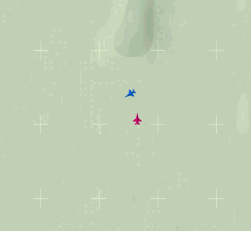
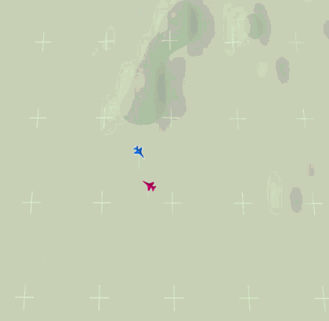
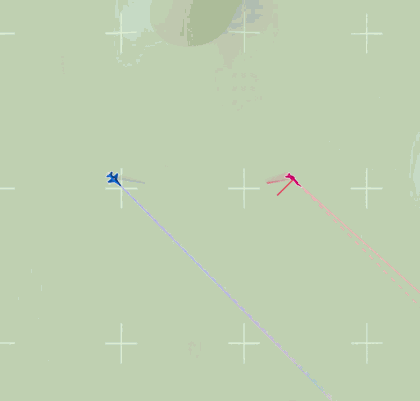
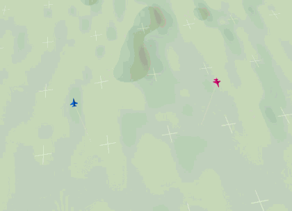

# aircombat-rl

Air combat environments on a JSBSim F-16.

```bash
pip install -e .
python -m aircombat_gym.wvr.play --env circular      # fly one yourself
```

From Python:

```python
import gymnasium as gym
import aircombat_gym.wvr.envs          # registers the ids

env = gym.make("AirCombat/Circular-v0")
```

## Environments

| | |
|---|---|
| <b><code>AirCombat/Circular-v0</code></b><br>An unarmed target holding a steady turn.  It never reacts to you.<br><a href="templates/project_01_circular">templates/project_01_circular</a> |  |
| <b><code>AirCombat/Evader-v0</code></b><br>An unarmed target that turns away when you close.<br><a href="templates/project_02_evader">templates/project_02_evader</a> |  |
| <b><code>AirCombat/AdvantagedFight-v0</code></b><br>Both aircraft armed.  You start roughly pointing at the opponent; it starts pointing anywhere.<br><a href="templates/project_03_advantaged">templates/project_03_advantaged</a> |  |
| <b><code>AirCombat/FairFight-v0</code></b><br>Both aircraft armed, well apart and pointing straight at each other.<br><a href="templates/project_04_fair">templates/project_04_fair</a> |  |

## What is in here

```
aircombat_gym/   the environments.  The only thing that gets installed
templates/       one folder per environment: what to hand in, and how to score it
tools/           grade and watch, shared by all of them
```

